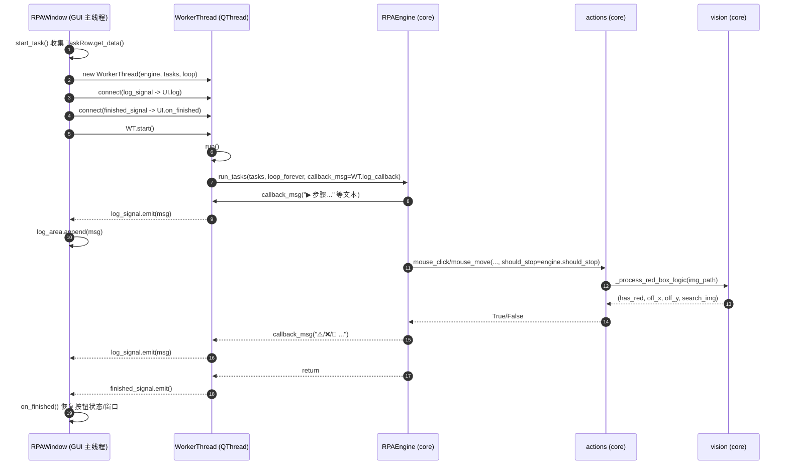
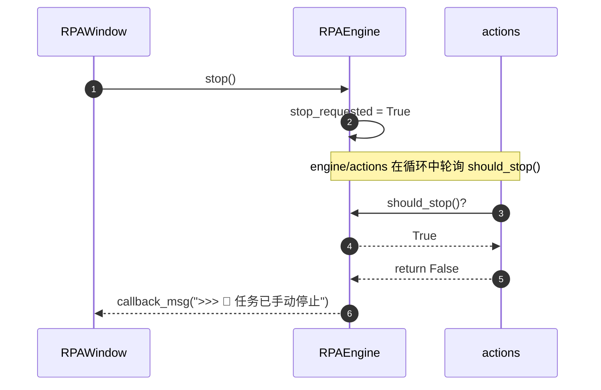

# WaterRPA 新代码结构 & 信号传递路径（UI ↔ 后台 ↔ Core）

本文档用于记录：
1) **模块化重构后的代码结构**（water_rpa 包：config/core/gui/main）。
2) **UI 与后台执行之间的信号/回调传递路径**（开始运行、日志回传、停止请求、任务执行调用链）。

> 说明：本文使用 Mermaid 绘图（VS Code 预览/Markdown 插件通常可直接渲染）。

---

## 1. 目录结构（高层）

当前仓库关键目录：

```
RPAAutoFucus/
├─ water_rpa/
│  ├─ __init__.py
│  ├─ config.py
│  ├─ main.py
│  ├─ core/
│  │  ├─ __init__.py
│  │  ├─ actions.py
│  │  ├─ engine.py
│  │  ├─ logging_setup.py
│  │  ├─ models.py
│  │  └─ vision.py
│  └─ gui/
│     ├─ __init__.py
│     ├─ app_window.py
│     ├─ components.py
│     ├─ custom_widgets.py
│     ├─ dialogs.py
│     └─ threads.py
├─ template/
├─ temp_masks/
├─ logs/
└─ requirements.txt
```

- `template/`：粘贴截图默认保存目录（GUI 的 PasteConfirmDialog）。
- `temp_masks/`：红框识别逻辑生成的临时透明化搜索图。
- `logs/`：运行日志落盘目录（启动时自动创建）。

---

## 2. 模块职责（按层）

- `water_rpa/main.py`
  - 程序入口：初始化 logging（落盘）、创建 `QApplication`、加载 QSS、展示主窗口。

- `water_rpa/gui/*`（UI 层，只依赖 PySide6，不直接做自动化）
  - `gui/app_window.py`：主窗口 `RPAWindow`，收集任务、启动/停止、显示日志。
  - `gui/threads.py`：`WorkerThread(QThread)`，后台线程执行 engine，并用 Signal 把日志/结束事件发回 UI。
  - `gui/components.py`：`TaskRow` 单行任务编辑组件。
  - `gui/custom_widgets.py`：`ImageLineEdit` 等自定义控件。
  - `gui/dialogs.py`：轻量对话框与粘贴截图保存逻辑。

- `water_rpa/core/*`（Core 层，禁止引入 PySide6）
  - `core/engine.py`：`RPAEngine`，任务调度、停止标志、分发到 actions。
  - `core/actions.py`：鼠标点击/悬停等自动化动作（`pyautogui`）。
  - `core/vision.py`：红框识别 + 透明化处理（依赖 Pillow）。
  - `core/models.py`：`RPATask` 数据类（engine 内部转换，GUI 仍可传 dict）。
  - `core/logging_setup.py`：logging 配置（RotatingFileHandler 写入 `logs/water_rpa.log`）。

---

## 3. 依赖关系图（编译期/导入期）

```mermaid
flowchart TB
  subgraph UI[GUI 层 water_rpa/gui]
    W[RPAWindow\n(gui/app_window.py)]
    T[WorkerThread\n(gui/threads.py)]
    R[TaskRow\n(gui/components.py)]
    D[Dialogs/Widgets\n(gui/dialogs.py + gui/custom_widgets.py)]
  end

  subgraph CORE[Core 层 water_rpa/core]
    E[RPAEngine\n(core/engine.py)]
    A[actions\n(core/actions.py)]
    V[vision\n(core/vision.py)]
    M[RPATask\n(core/models.py)]
    L[logging_setup\n(core/logging_setup.py)]
  end

  C[config\n(water_rpa/config.py)]
  MAIN[main\n(water_rpa/main.py)]

  MAIN --> C
  MAIN --> L
  MAIN --> W

  W --> T
  W --> R
  W --> D
  W --> E

  T --> E

  E --> A
  A --> V
  E --> M

  C -.constants/path/QSS.-> W
  C -.constants/path.-> D
  C -.constants/path.-> V
  C -.constants/path.-> E

  classDef ui fill:#E8F3FF,stroke:#4B89DC,stroke-width:1px;
  classDef core fill:#E9F7EF,stroke:#2E8B57,stroke-width:1px;
  classDef cfg fill:#FFF7E6,stroke:#D48806,stroke-width:1px;
  classDef entry fill:#FDE7F3,stroke:#C41D7F,stroke-width:1px;

  class W,T,R,D ui;
  class E,A,V,M,L core;
  class C cfg;
  class MAIN entry;
```

核心约束：
- GUI 只通过 `WorkerThread` 启动 core 执行，并通过 Signal/回调拿到日志。
- Core 层完全不依赖 PySide6，便于测试与复用。

---

## 4. 运行时信号/回调路径（关键链路）

### 4.1 “开始运行”链路（UI → 后台线程 → Core）



要点：
- **跨线程 UI 更新**只通过 `Signal`（`WorkerThread.log_signal`）完成。
- Core 层对 UI 完全无感：它只知道 `callback_msg(str)`。

### 4.2 “停止”链路（UI → Core，后台轮询 should_stop）



- `RPAWindow.stop_task()` 直接调用 `engine.stop()`。
- `actions.mouse_click/mouse_move` 内部使用 `should_stop()` 轮询，实现与 engine 解耦。

### 4.3 “日志落盘”链路（main 初始化 → logging 写入 logs/）

```mermaid
flowchart LR
  MAIN[main.py] --> LS[setup_logging(LOG_FILE)]
  LS --> FH[RotatingFileHandler]
  LS --> SH[StreamHandler(stderr)]
  FH --> FILE[logs/water_rpa.log]

  subgraph Runtime[运行期记录来源]
    V[vision.py logger.exception]
    A[actions.py logger.exception/节流]
    E[engine.py logger.exception/info]
  end

  V --> FH
  A --> FH
  E --> FH
```

---

## 5. “一条任务”在 core 内部的执行分发（engine → actions/pyautogui）

```mermaid
flowchart TB
  EN[RPAEngine.run_tasks]
  TASK[RPATask(type,value,retry)]

  EN --> TASK

  TASK -->|1/2/3/8 图片类| RES[resolve_path\n相对路径按 REPO_ROOT 解析]
  RES --> ACT[actions.mouse_click / mouse_move]
  ACT --> VSN[vision._process_red_box_logic]
  ACT --> PA[pyautogui.locateOnScreen/click/moveTo]

  TASK -->|4 输入文本| CLIP[pyperclip.copy] --> HOTKEY[pyautogui.hotkey(ctrl,v)]
  TASK -->|5 等待| SLEEP[time.sleep(0.1) 轮询停止]
  TASK -->|6 滚轮| SCROLL[pyautogui.scroll]
  TASK -->|7 系统按键| HK[pyautogui.hotkey(*keys)]
  TASK -->|9 截图保存| SS[pyautogui.screenshot(file)]

  classDef core fill:#E9F7EF,stroke:#2E8B57;
  class EN,TASK,RES,ACT,VSN,PA,CLIP,HOTKEY,SLEEP,SCROLL,HK,SS core;
```

---

## 6. 常见排查点（对应信号/链路）

- UI 日志没有刷新
  - 检查 `WorkerThread.log_signal.connect(RPAWindow.log)` 是否存在。
  - 检查 engine 是否调用了 `callback_msg`。

- 点击/悬停一直找不到图
  - 检查任务 `value`：相对路径会按 `REPO_ROOT` 解析，确认 `template/...png` 实际存在。
  - 查看 `logs/water_rpa.log`：`vision/actions/engine` 的异常会落盘（包含堆栈）。

- 停止不生效
  - UI 是否调用 `engine.stop()`。
  - actions 循环是否在持续运行（它会轮询 `should_stop()`）。

---

## 7. 版本说明

- 本文档对应入口：`python -m water_rpa.main`
- Python 3.9 兼容：`RPATask` dataclass 未使用 `slots=True`（该参数需要 3.10+）。
