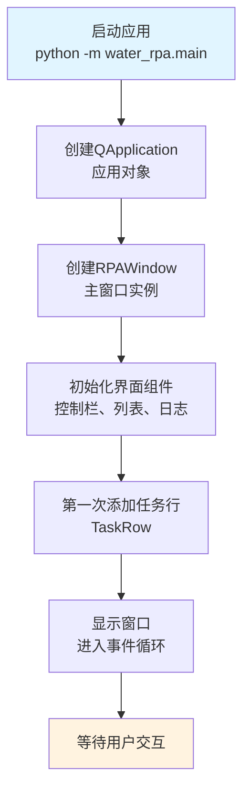
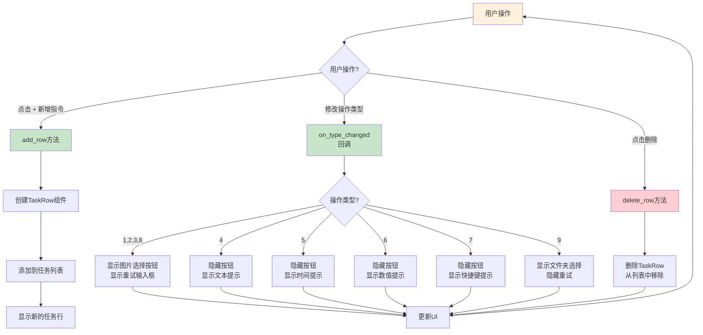
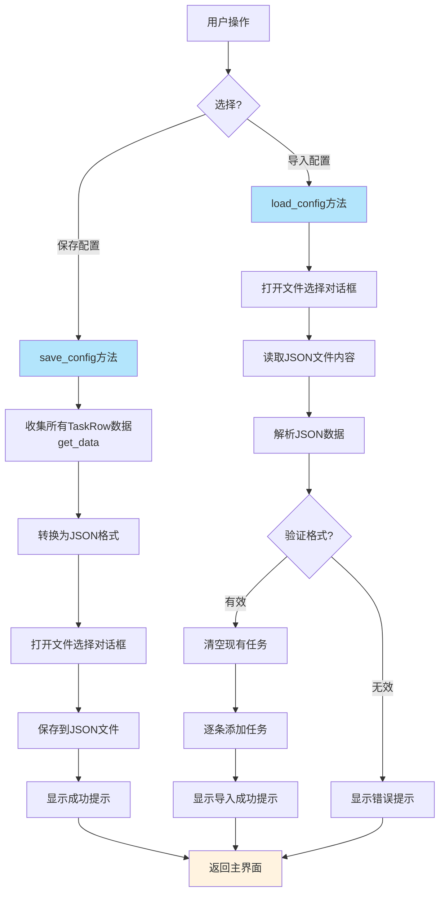
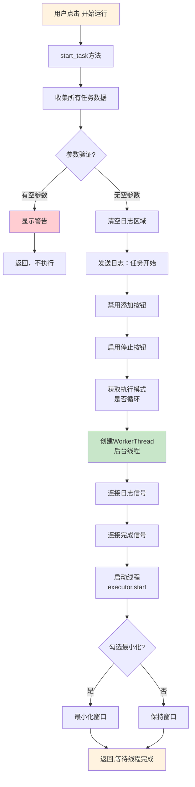
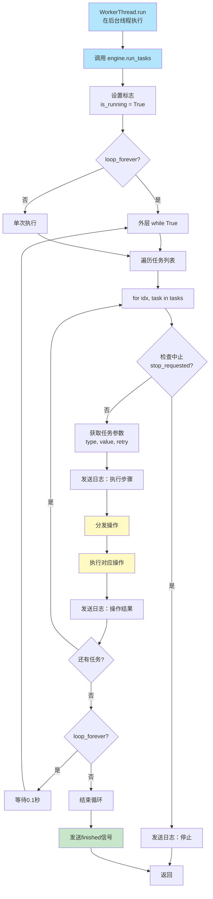
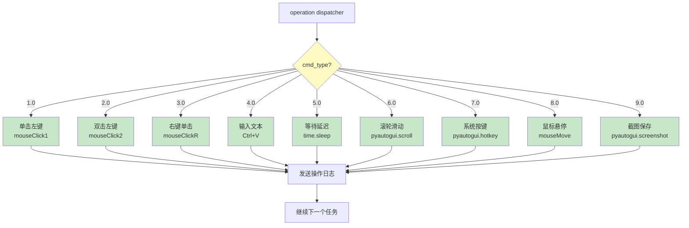
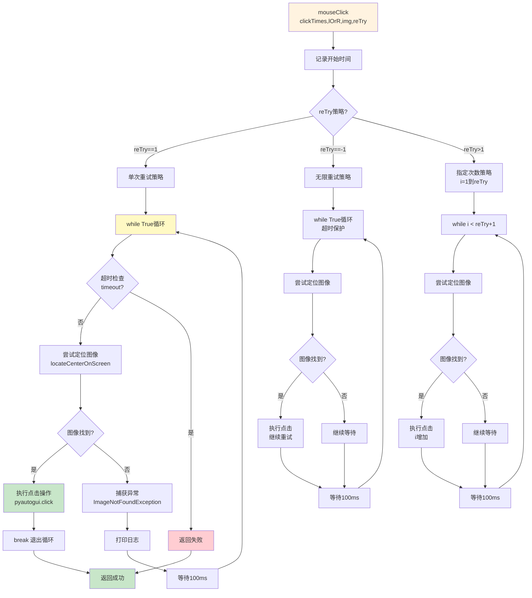
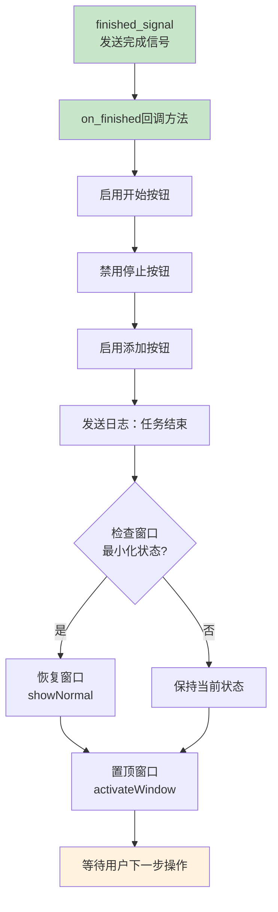
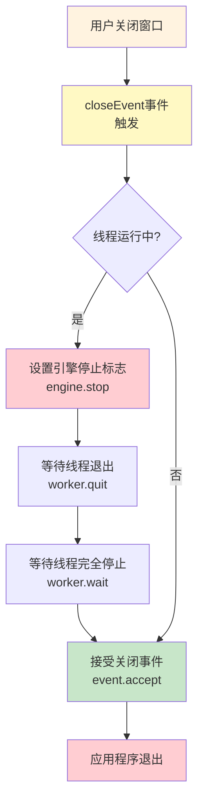
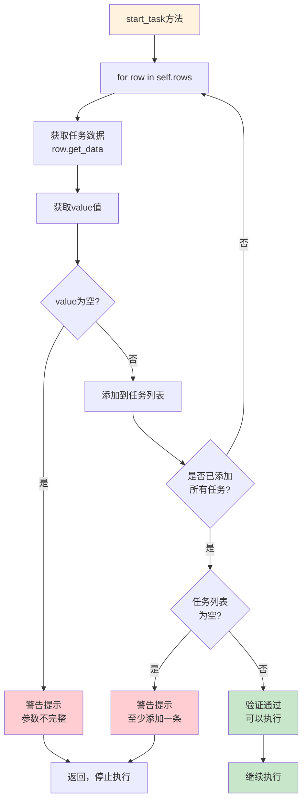

# WaterRPA 运行逻辑可视化

## 1. 应用启动流程

## 2. 任务配置流程

## 3. 配置保存与加载

## 4. 任务执行总流程

## 5. WorkerThread 后台线程执行

## 6. 操作分发与执行

## 7. 图像识别与点击流程（mouseClick）

## 8. 任务完成与界面恢复

## 9. 应用关闭事件处理

## 10. 参数验证流程

---

**这些流程图展示了WaterRPA应用从启动、配置、执行到完成的完整逻辑链路。**
